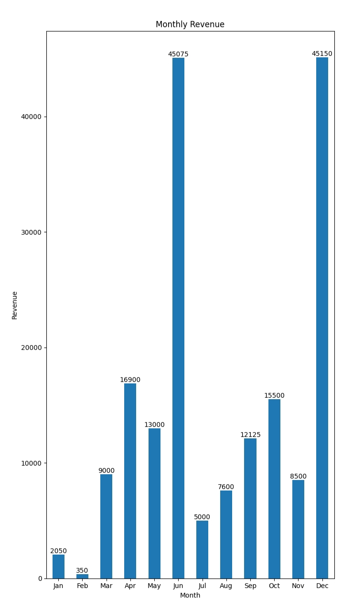
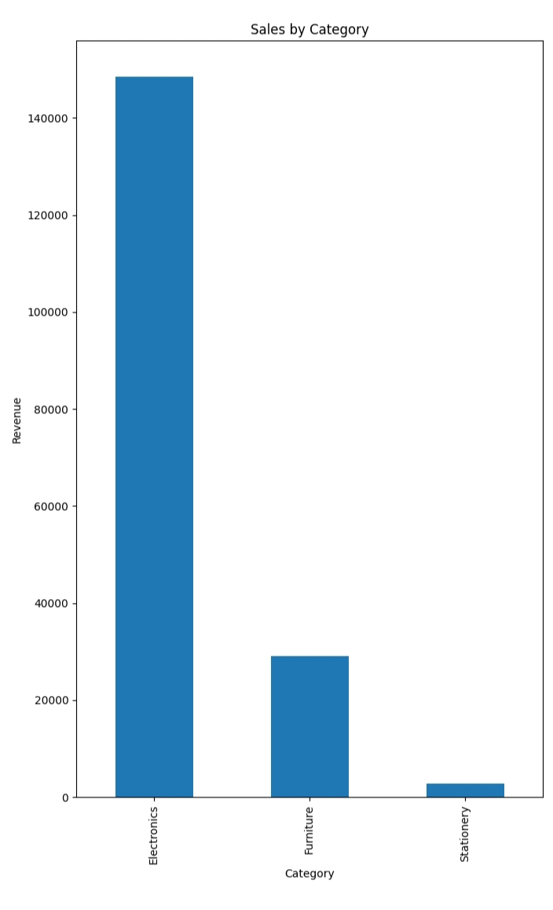

📊 Sales & Customer Insights Analysis (SQL + Python)

"Python" (https://img.shields.io/badge/Python-3.x-blue)
"SQL" (https://img.shields.io/badge/SQL-Intermediate%20to%20Advanced-green)
"Status" (https://img.shields.io/badge/Project-Completed-brightgreen)

---

📌 Project Overview

This project analyzes sales data to generate meaningful business insights using SQL and Python. It demonstrates how raw transactional data can be transformed into actionable insights for decision-making.

---

❓ Business Questions Answered

- What is the monthly revenue trend?
- Which product category generates the most revenue?
- Who are the top customers?
- Are there repeat customers?
- Which cities generate the highest sales?

---

🛠 Tools & Technologies

- SQL (Joins, Aggregations, Window Functions)
- Python (Pandas, Matplotlib)
- CSV Dataset

---

📂 Project Structure

- "sales_data.csv" → Dataset
- "analysis.py" → Python analysis & visualization
- "sql_queries.sql" → SQL queries
- "images/" → Output charts

---

📊 Key Analysis Performed

- Monthly revenue trend analysis
- Product category performance
- Customer purchase behavior
- City-wise sales distribution

---

🧠 SQL Highlights

- Used "GROUP BY" for aggregations
- Applied "HAVING" for filtering aggregated results
- Used "ORDER BY" for ranking outputs
- Structured queries for business insights

---

📈 SQL Coverage

Includes both intermediate and advanced SQL queries (JOINs, window functions, database design)

---

📸 Output Screenshots

Monthly Revenue

Category-wise Sales

---

📈 Key Insights

- Revenue peaks in June and December due to high-value electronics purchases
- Electronics contribute highest revenue despite fewer transactions
- Stationery products generate consistent but lower revenue
- Customer purchasing behavior shows repeat buyers contribute significantly
- Seasonal trends indicate opportunities for targeted marketing

---

🖥 How to Run

1. Install Python
2. Install required libraries:
   pip install pandas matplotlib
3. Run the script:
   python analysis.py

---

🚀 Project Outcome

Developed a complete data analysis solution combining SQL and Python to extract insights from structured data and support business decision-making.

---

🔗 Author

Praveen Savadi
